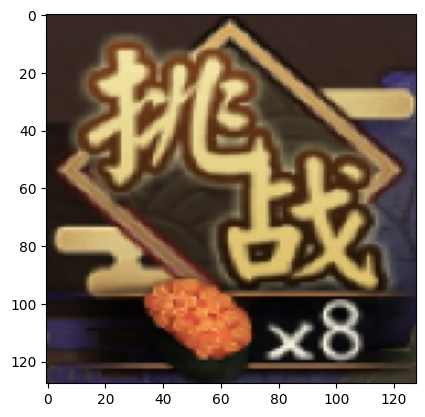
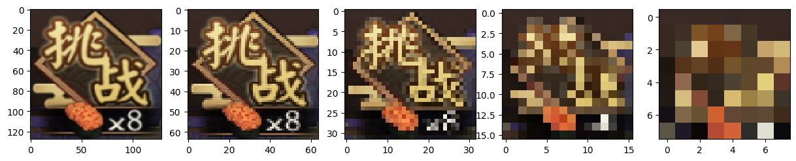
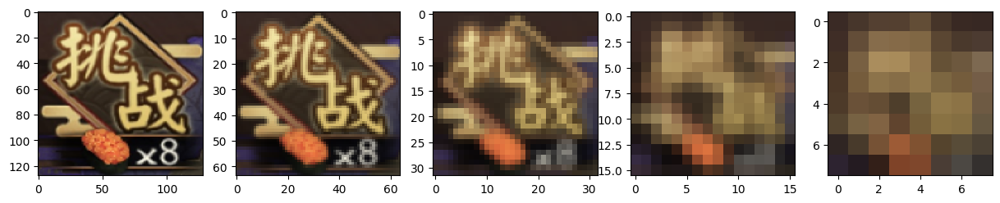
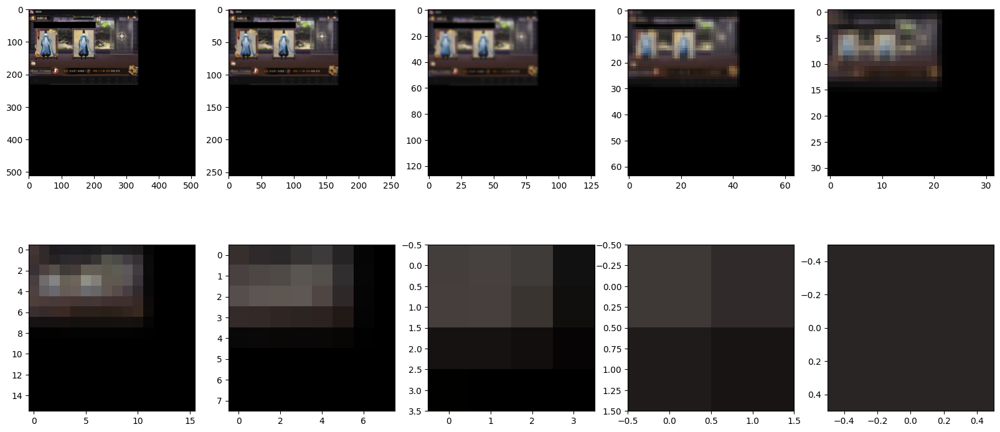
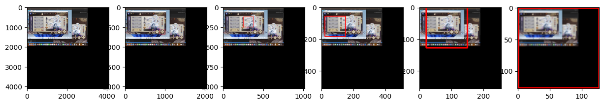
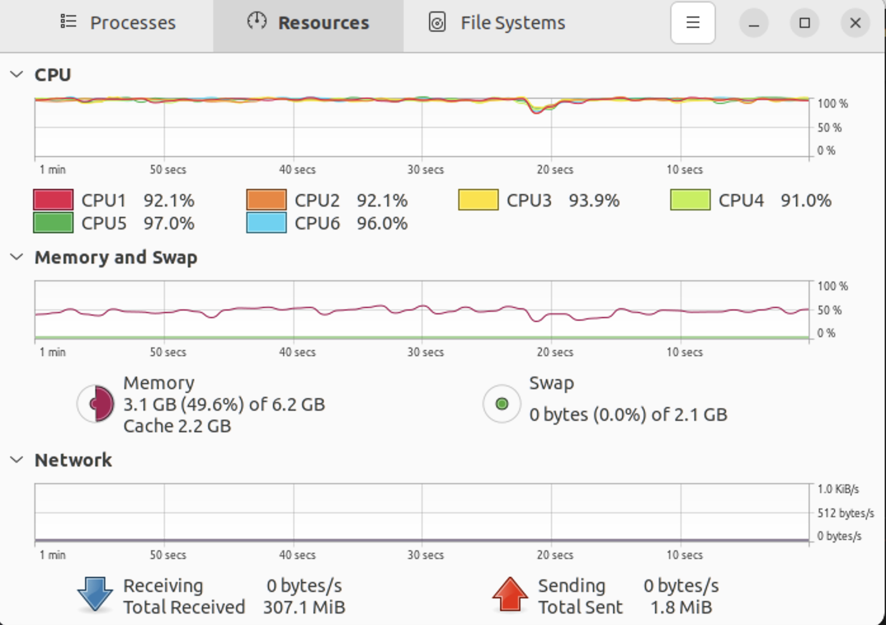

# CSCI 4060U Final Project Report

## About me

- Wenbo Zhang ([Falanan](https://github.com/Falanan))

## About this course

CSCI 4060U: Massively Parallel Programming. An advanced undergraduate course on programming for multicore and many-core systems. Programming approaches for systems with multiple central processing units (CPUs) will include programming with preprocessor directives (e.g., OpenMP), threads and actors. Programming approaches for systems with many graphical processing units (GPUs) will include programming with task and data parallelism (e.g., OpenCL, CUDA). This course will also discuss challenges in parallel programming including optimization and debugging. 3cr, 3 lec, 1.5 lab. Prerequisite: CSCI 3070U.

- INSTRUCTOR:  ([Dr. Jeremy S. Bradbury](https://www.sqrlab.ca/bradbury/))
- Course website Link: ([CSCI 4060U Winter 2023](https://www.sqrlab.ca/csci4060u/))

## Introduction

### Thoughts on this project

  I have been playing a game called <strong>Onmyoji</strong>, while I have been playing this game for 6 years. Last semester, I finished studying computer vision. Although this class was very torturous, I still had fun in that course. During the winter break, an idea came to my mind, can I use the knowledeg learned from computer vision and write a automation script for the game? Because this game start screen and end settlement screen is fixed, the middle of the battle process is fully automatic, can be ignored. So I only need to detect the start screen and the end screen to complete the automation of this game. This way I can get the painted scrolls relatively easily. This is too tempting for people like me who basically can't summon a new character for each event.

### Technology/Tools used in the project

Computer vision, OpenMP, POSIX Thread, Hyperfine

Install OpenCV: ([OpenCV installation overview](https://docs.opencv.org/4.x/d0/d3d/tutorial_general_install.html))

Install Hyperfine performance test tool: ([A command-line benchmarking tool](https://github.com/sharkdp/hyperfine))

## Analysis of Technology Used
In this section, I will detail the idea of developing the script.

### Part 1: Interface detection
#### Template processes
Firstly, I took a screenshot of the waiting interface for two peolpe as a team, then crop the challenge button.

This picture will be used as a template later in the whole program. The shape of the cropped template image is (214, 187, 3).
Then resize the image to 128 x 128 as showen below.

The reason for resizing the template to 128 * 128 is because the image must be square in the subsequent processing.

1. Continuously produce 1/2 resolution template until the resolution is only 8 * 8.

2. Generate the gaussian pyramid based on different templates generated in first step. In this step also stop at the resolution of the template is only 8 * 8.
Here I only use 128 * 128 resolution images for demonstration.

The reason I stop at 8 * 8 resolution is because I believe lower resolutions contain too little information and can negatively affect the final result.

#### Original image processes
The processing of the original image is done in a similar direction to the processing of the template.

Preview of the original image:

Here are procedures:
1. Turn the original image into a square shape.

In this step, I cannot compress the original rectangular image directly into a square. Because this will lose some information and at the same time lose the coordinate mapping. Because I have to find the pixel position of the template in the original image. What I do in this step is to create a larger canvas first, which should be an even multiple of 2 in size. Fill the canvas with black pixels and copy the original image to the new canvas from the position (0, 0).

2. Generate half resolution images like the procedure in the template processes.
3. Generate gaussian pyramid for each different resolution image.

This is the result of a 512 * 512 resolution photo-based processing.

In the processing of the original image, I discard the photos with a resolution lower than 32 * 32. We can see from the picture that the resolution below 32 * 32 contains too little information and there is no longer a need to process it.

#### Template matching

In OpenCV, there is a built in function called "matchTemplate". Feed template, original image and the matching method, this function will returns the highest matching position. Then draw a box based on the size of the template. Then, this position is where the template is most likely to appear.

Example match plot:

After matching all the templates completed in the previous steps with the original image, we will get an array of matching positions, and store the x-axis and y-axis of matching positions in two arrays respectively.

Here are sample of x-axis and y-axis values:

<strong>x-axis:</strong> [482, 608, 608, 608, 608, 426, 16, 630, 608, 608, 608, 608, 426, 16, 659, 608, 608, 608, 648, 16, 625, 608, 608, 37, 9, 38]

<strong>y-axis:</strong> [248, 345, 346, 344, 344, 371, 344, 366, 345, 346, 344, 344, 371, 344, 364, 346, 344, 344, 52, 344, 347, 344, 344, 323, 236, 329]

In the above array, we can clearly conclude that the most likely matching position is [608, 345], while there are many outliers in the array. The next step is to handle the outliers.

### Part 2: Handling of Outliers
The idea of handling outliers is data clustering (DBSCAN).

When dealing with outliers we can't simply take out the value that occurs most often in the array, as this is riskier and the position has the possibility of being shifted. So in this step I use the DBSCAN idea in data clustering. For each value in the array, we take a range of +-3, and then traverse the entire array, as long as the data in this range is more than 7, then we consider this data as a useful data. For example, the data in y-axis array, take the data 345, then go to the range of +-3 is [342-348], traverse the array, and there are more than 7 data in [341-348]. So we think 345 is a useful data. Then the useful data is written to another array called highest_possible_y_pos for the next step of processing.

After the processing of outliers is complete, the data in the highest_possible array is de-averaged and rounded up. This way, the final data is the position of the template in the original image.

### Part 3: Parallelize the Procedures
In this section, I use two methods to process the data in parallel.

#### OpenMP
OpemMP is a great tool to parallelize the process, we can focus more on maximize the parallel region without need to consider about the data on each thread.

In this program, I use for loops extensively, so parallel processing of for loops is a very important thing. Also note that c++ vectors are not thread-safe, all modifications to vectors must add critical regions, otherwise they will cause data race.

#### POSIX Thread
pthread is also a way to handle threads in C++. pthread's biggest drawback is that it needs to handle each thread's data itself, which greatly reduces data security. Also pthread is not very compatible with classes.

## Performance Test
Test Computer: Macbook Pro with M1 Pro processor
Test Environment: Arm version of Ubuntu20.04LTS under a virtual machine in MacOS

The reason using virtual machine is because we can decide the number of processor cores in the virtual machine so that we can easily compare the performance of programs in different environments.

For the performance test session, I prepared 46 screenshots, and comparing the time to complete all the photos to finish processing, the performance of the program can be evaluated.

### Sequential Version

Compile command: g++ script.cpp -std=c++11 `pkg-config --cflags --libs opencv4` -o seq

Performance test command: hyperfine "./seq"

Benchmark 1: ./seq
 
&nbsp&nbsp Time (mean ± σ):     218.469 s ±  4.234 s    [User: 195.000 s, System: 23.715 s]
 
&nbsp&nbsp Range (min … max):   212.808 s … 225.310 s    10 runs

### POSIX Thread Version
In this part, we control the number of cores in the virtual machine to 2 and 4 of 6 for testing separately.

##### 6 cores

Compile command: g++ script.cpp -std=c++11 `pkg-config --cflags --libs opencv4` -o pthread

Performance test command: hyperfine "./pthread"

Benchmark 1: ./pthread
 
&nbsp&nbsp Time (mean ± σ):     39.757 s ±  0.330 s    [User: 201.375 s, System: 24.230 s]
 
&nbsp&nbsp Range (min … max):   39.440 s … 40.495 s    10 runs

##### 4 cores

Compile command: g++ script.cpp -std=c++11 `pkg-config --cflags --libs opencv4` -o pthread

Performance test command: hyperfine "./pthread"

Benchmark 1: ./pthread
 
&nbsp&nbsp Time (mean ± σ):     58.925 s ±  2.024 s    [User: 205.556 s, System: 21.497 s]
 
&nbsp&nbsp Range (min … max):   57.864 s … 64.523 s    10 runs

##### 2 cores

Compile command: g++ script.cpp -std=c++11 `pkg-config --cflags --libs opencv4` -o pthread

Performance test command: hyperfine "./pthread"

Benchmark 1: ./pthread
 
&nbsp&nbsp Time (mean ± σ):     118.485 s ±  1.277 s    [User: 207.266 s, System: 20.330 s]
 
&nbsp&nbsp Range (min … max):   116.262 s … 119.794 s    10 runs

### OpenMP Version
In this part of the test, I divided the test situation into two cases. The first is to set the number of threads to 2, 4, and 6 at the very begainning of the main function, and then the system has 6 cores. The second case is to determine the number of threads before each for loop, and then test on a system with  2, 4, and 6 cores.

#### Case 1: Fixed Number of Thread
##### 6 threads

Compile command: g++ script.cpp -fopenmp -std=c++11 `pkg-config --cflags --libs opencv4` -o omp6

Performance test command: hyperfine "./omp6"

Benchmark 1: ./omp6
 
&nbsp&nbsp Time (mean ± σ):     61.360 s ±  1.985 s    [User: 273.244 s, System: 28.271 s]
 
&nbsp&nbsp Range (min … max):   58.232 s … 65.122 s    10 runs

##### 4 threads

Compile command: g++ script.cpp -fopenmp -std=c++11 `pkg-config --cflags --libs opencv4` -o omp4

Performance test command: hyperfine "./omp4"

Benchmark 1: ./omp4
 
&nbsp&nbsp Time (mean ± σ):     66.809 s ±  5.278 s    [User: 223.668 s, System: 26.352 s]
 
&nbsp&nbsp Range (min … max):   60.364 s … 73.523 s    10 runs

##### 2 threads

Compile command: g++ script.cpp -fopenmp -std=c++11 `pkg-config --cflags --libs opencv4` -o omp2

Performance test command: hyperfine "./omp2"

Benchmark 1: ./omp2
 
&nbsp&nbsp Time (mean ± σ):     115.998 s ±  1.213 s    [User: 198.042 s, System: 22.637 s]
 
&nbsp&nbsp Range (min … max):   113.964 s … 117.511 s    10 runs

#### Case 2: Dynamically Determine the Number of Threads & Fixed Number of Cores.
##### 6 cores

Compile command: g++ script.cpp -fopenmp -std=c++11 `pkg-config --cflags --libs opencv4` -o omp

Performance test command: hyperfine "./omp"

Benchmark 1: ./omp
 
&nbsp&nbsp Time (mean ± σ):     43.587 s ±  5.514 s    [User: 220.994 s, System: 18.616 s]
 
&nbsp&nbsp Range (min … max):   39.953 s … 57.000 s    10 runs

##### 4 cores

Compile command: g++ script.cpp -fopenmp -std=c++11 `pkg-config --cflags --libs opencv4` -o omp

Performance test command: hyperfine "./omp"

Benchmark 1: ./omp
 
&nbsp&nbsp Time (mean ± σ):     65.065 s ±  3.428 s    [User: 232.185 s, System: 16.025 s]
 
&nbsp&nbsp Range (min … max):   58.233 s … 68.395 s    10 runs

##### 2 cores

Compile command: g++ script.cpp -fopenmp -std=c++11 `pkg-config --cflags --libs opencv4` -o omp

Performance test command: hyperfine "./omp"

Benchmark 1: ./omp
 
&nbsp&nbsp Time (mean ± σ):     113.785 s ±  0.745 s    [User: 203.387 s, System: 15.035 s]
 
&nbsp&nbsp Range (min … max):   113.043 s … 115.327 s    10 runs

Performance Test Screenshot:

## Conclusion

According to the performance test data, OpenMP and Pthread run roughly the same performance with fewer cores. But as the number of cores increases, OpenMP has some advantages. Of course this could also be a difference in the code. Because in the Pthread version, there are not as many parallel regions as in OpenMP, because the Pthread code is harder to write. But even that is much faster than the sequential version of the program.

Out of a total of 46 images processed, the **sequential version** took 218 seconds, which means that it took 218/46 = 4.74 seconds to process a single image. With a game taking only 20 seconds, it is clear that 5 seconds to process a photo is unacceptable. If the system has only 4 cores of computing resources to supply to the program, as the other cores need to be supplied to the game. In this case, the processing speed is about the same for both **POSIX Thread and OpenMP version**, about 60 seconds. The processing speed for each image is 60/46 = 1.3 seconds. Significantly faster processing speed. Processing one photo per second is an acceptable speed.

